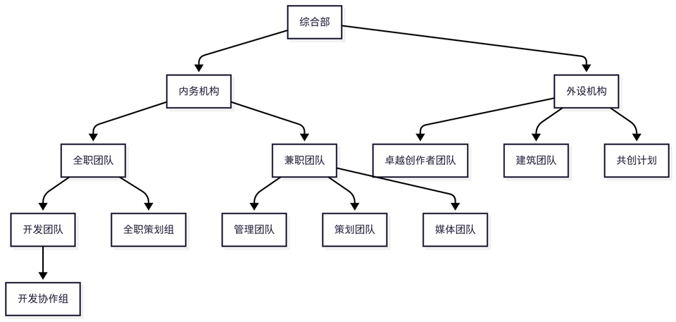

## 第一章 总章

### 1.1 总则说明

EaseCation 小游戏服务器总则（以下简称“总则”）在EaseCation 小游戏服务器（以下简称“EaseCation”）的规程体系中具有根本地位，所有工作应基于总则展开，所有文档不得同总则相抵触，总则对EaseCation所有规定具有普遍约束力。

总则的解释权、编辑权与存废决定权归EaseCation 综合部（General Department，简称GD）所有。

### 1.2 名词解释

#### 1.2.1 宁波易什网络技术有限公司

宁波易什网络技术有限公司（以下简称“我司”）系EaseCation的注册官方企业，在所有业务中保留最高裁决权。

#### 1.2.2 最高裁决权

最高裁决权依据《宁波易什网络技术有限公司章程》通过股东会的形式执行，具体规则概况如下：

1. 公司股东会由两人组成。其中大股东方逸舟占股51%，兼任公司法人代表和执行董事；鲍俊轩占股49%，兼任公司总经理。
1. 股东会对公司增加或减少注册资本、分立、合并、解散、变更公司形式和修改公司章程应由三分之二以上股东表决通过；
1. 其他决议应由公司二分之一以上股东表决通过；
1. 公司监事为张峻豪，任期三年。监事对股东会负责，依法行使《公司法》第五十三条规定的第1至第6项职权。监事可以列席股东会会议，监事发现公司经营情况异常，可以进行调查；必要时可以聘请会计师事务所等协助其工作，费用由公司承担。

#### 1.2.3 EaseCation

EaseCation系上海易什网络技术有限公司注册商标（注册号41509324，国际分类41），授权宁波易什网络科技有限公司使用。

若玩家对EaseCation的制度、规则、奖励与价值观有任何疑问、建议，欢迎向EaseCation 官方咨询、提出具有建设性的意见。

EaseCation所有规则不得与中华人民共和国法律和宁波易什网络技术有限公司章程相违背，一切规则均首先以中华人民共和国法律和宁波易什网络技术有限公司章程为准。

### 1.3 规程制定与指导思想

#### 1.3.1 规程制定

面向玩家的规程与面向内部团队的规程均应由综合部组织编写制定，并经综合部全体认可。适当情况下规程制定过程中可以征集官方机构成员与玩家的意见。所有规程类文档（包括《总则》）需要经过综合部最终审批，方可实行。

#### 1.3.2 指导思想

EaseCation 希望形成民主、自由、开放的游戏及社群环境。玩家与管理员应相互尊重，相互理解。管理员权力需要在制度规定下运行，玩家有权对管理员操作及决定提出申诉、有权提议修改现有规程。EaseCation 倡导平等的观念，无论是玩家还是管理，一切违规行为都应平等地受到处罚。

### 1.4 版本解释

#### 1.4.1 2025/7/9修正备注

《总则》已于2025年7月9日进行重大修订，总第五版。本次修订旨在配合EaseCation面对的服内外新形势，以指导方针的地位帮助处理新形势下各类事件。本次修订全面重构了《总则》内容及形式结构，以适应新的管理模式与社区环境。

## 第二章 人力管理

### 2.1 团队架构

EaseCation 团队架构如下表所示，共包含3个大类和多个机构。

其中，外设机构成员不属于我司员工或成员，外设机构的设立仅代表我司对该机构的存在表示认可。团队设置、组织与解散需由综合部批准后方可执行，否则视为无效操作。

### 2.2 成员类型

#### 2.2.1 在职状态

目前我司成员分为以下在职状态：

| **全职员工** | **兼职员工** |
| :----------: | :----------: |
|  公司高管职  |   高级兼职   |
|    技术岗    | 游戏内容兼职 |
|    策划岗    | 用户管理兼职 |
|    实习岗    | 媒体运营兼职 |
|  开发协作岗  |   实习兼职   |

#### 2.2.2  部门划分

按照在职状态，各成员被划分进入如下部门：

- 综合部：公司高管职、高级兼职
- 开发团队：技术岗、开发协作岗、实习岗
- 管理团队：用户管理兼职、实习兼职
- 策划团队：实习岗、策划岗、游戏内容兼职、实习兼职
- 媒体团队：媒体运营兼职

### 2.3 岗位规程

#### 2.3.1 岗位招新

各岗位招新需满足以下基本要求：

- 全职员工：年满16周岁。
- 兼职员工：年满16周岁且为在校学生或正在其他公司担任全职岗位。

**2.3.1.1** 全职员工招新需经综合部面试后决定，具体招新方案由综合部决定。

**2.3.1.2** 兼职员工招新由综合部决定并组织，面向玩家群体开展自主招新或统一招新。

#### 2.3.2 岗位调动

所有人事调动必须至少经一名公司高管职务确认后方可生效，且内容需由综合部对外公布。

#### 2.3.3 休假

员工应于ECHR系统提交休假申请并及时与人力资源部门联系。休假申请不可撤回，且EaseCation保留拒绝休假申请的权利。各岗位休假最长期限为90天，特殊情况下，成员可在休假申请前向综合部申请延长休假期限至120天。员工休假期间所有权限将被暂停，且休假期间EaseCation人事部门不对休假员工保证任何结算和奖励。休假期间员工仍然需要遵守相关规则和协议。休假结束后需立刻联系人力资源部门，并确保ECHR系统在休假结束后被立刻恢复。没有立刻恢复导致的入职时间计算错误和错过最晚复职时间的后果由休假员工自行承担。

### 2.4 离职

#### 2.4.1 主动离职

员工应于ECHR系统提交离职申请并及时与人力资源部门联系。离职申请不可撤回，离职申请不可拒绝。在离职申请被批准后员工权限将被立刻取消，ECHR内未结算资金将会被并入团队建设基金。员工离职后仍需按照协议规定遵守对应协议；离职后再次加入团队应得到对其他普通申请人一致平等的对待。

#### 2.4.2 被动离职

被动离职是因企业运营需要要求员工离开公司的行为。具体离职流程按照《兼职协议》或《劳务协议》中的条款执行。

**2.4.2.1** 被动离职同样有遵守本规则第2.4.1条内全部条款的义务。

#### 2.4.3 自动离职

满足以下任意条件的将会被办理自动离职：

- 管理团队在职期间超过4个月无任何操作数据的；
- 管理团队在职期间超过4个月未领取权限的；
- 策划团队超过6个月未产出任何内容的；
- 综合部超过4个月未进行任何有价值产出的；
- 飞书内超过3个月未进行任何发言的。

**2.4.3.1** 自动离职同样有遵守本规则第2.4.1条内全部条款的义务。

### 2.5 界定

员工入职时间界定以我司ECHR系统显示信息为准。

### 2.6 权限管理

#### 2.6.1 定义

权限指的是由我司授予的任何权利与特权，包含代理权限、游戏权限、平台账号权限、游戏特权、管理权限等。权限与实际职位无实际对照关系，任何人均有权利在综合部认为需要的情况下获得任何权限。综合部保留撤销游戏内权限的权利。任何权限均不得在未获得授权的前提下出借、转移（包括买卖）或与非员工身份的人共同持有等。

#### 2.6.2 定位

权限包含一定的特权，这一部分特权通常指游戏内的VIP4等相关内容，是EaseCation对员工付出所给予的虚拟支持。拥有权限不意味着员工拥有高于玩家的任何特权。官方机构成员必须同样遵守所有对玩家生效的规则。在此基础上，禁止讽刺挖苦、恶意诋毁、攻击、侮辱谩骂任何与EC有关的个人与组织。禁止使用管理员操作面板嘲讽、辱骂或者中伤其它玩家。

**2.6.2.1** 根据以上内容，员工在与玩家交流时不应有任何高于玩家的表述。员工应简洁表达，使用正常、友善的语气与玩家交流，确保：不使用反问的语气来质问对方（如：“难道你敢说你没有开挂吗？”）；不人身攻击、强扣帽子（如：“岩浆狗”“挂逼”）；不故意多次重复强调某条信息，及其它一切可能导致双方地位不对等的交流内容。

#### 2.6.3 游戏内容管理权限

EaseCation内务团队对以用户管理兼职为主的多个岗位发放游戏内容管理权限，旨在管控游戏氛围，打击游戏违规行为。所有违规行为必须按照《EaseCation 小游戏服务器玩家守则》（下称《玩家守则》）进行处理。对于所有玩家之间的事务争议，EaseCation原则情况下不处理也不支持内部机构成员处理。若内部成员选择参与处理的，则不应以EaseCation官方名义参与。

#### 2.6.4 工单处理权限

EaseCation内务团队对以用户管理兼职为主的多个岗位发放工单处理权限，旨在及时处理玩家需求，帮助玩家解决疑难杂症。出于数据安全和取证的目的，我司禁止任何官方机构成员通过私聊、邮件、QQ群等方式处理任何有关玩家账号数据的事务，包括申诉、举报、补发、发送礼包等。封禁/解封/发送礼包等涉及游戏内容的操作必须通过工单系统完成。在处理玩家工单时，员工同样应遵循《玩家守则》相关规定。

#### 2.6.5 隐私接触权限

在内务事项中员工极有可能接触到部分玩家隐私，综合部成员可能接触到内务团队成员隐私。EaseCation确保保护一切隐私内容，作为官方机构成员，不论在任何时间、地点、情境下，不得与任何组织或个人合作，故意参与到任何与泄露玩家个人信息、隐私等有关的活动中。不得以“披露玩家个人信息”为由恐吓威胁其它玩家。

#### 2.6.6 匿名系统使用权限

EaseCation内务团队对以用户管理兼职为主的多个岗位发放匿名系统使用权限，旨在帮助员工处理服内事项。员工应规范使用匿名系统。禁止任何官方机构成员滥用匿名系统，给玩家造成困扰和不必要的麻烦，例如做出以下行为：

- 伪装虚假身份，如：\[超级管理员\]、\[服主\]
- 伪造虚假权限名称
- 伪造称号
- 使用特殊字符（包括彩色字符和表情字符）
- 使用包含违规言论的名称
- 冒充其他玩家，对其他玩家的声誉造成影响

#### 2.6.7 处罚与处理

权限的使用必须严格遵循本规则2.6节的全部内容，禁止滥用职权，且官方机构成员不得以任何形式使用权限恐吓、威胁玩家。若发现处理方式不妥，根据本节规定酌情作出以下处理：

- 权限使用违反2.6.3.1款，2.6.6条，及2.6.3至2.6.4条的，依情节作出警告一次；实习管理员延长一个月实习期，正式管理员贬职为实习管理员；撤销权限，单次除名；撤销权限并列入黑名单的惩罚。
- 权限使用违反2.6.5条的，一经查明，立即撤销该成员的所有权限，作解雇处理；将其加入官方机构成员黑名单，并对其游戏账号执行“关闭游戏账号”的处罚。
- 利用权限恐吓、威胁玩家的，一经查明，立即撤销该成员的所有权限，作解雇处理；将其加入官方机构成员黑名单，并对其游戏账号执行“关闭游戏账号”的处罚。
- 内部人员未经授权参与处理玩家之间争论并造成严重不良影响的，酌情执行相关处罚。
- 内部人员之间发生纠纷的，应秉承“大事化小，小事化了”的原则由综合部主持处理。

## 第三章 信息安全

### 3.1 信息收集

出于服务和营销目的，EaseCation会在法律允许的范围内收集玩家个人或设备信息。这可能包括：
- 游戏记录；
- 设备特征信息；
- 网络连接信息；
- 其他必要信息。

### 3.2 玩家信息保护

#### 3.2.1 保护方式

EaseCation通过以下手段保护玩家信息：

1. 通过安全的网络传输方式；
1. 验证所有服务商数据安全资格；
1. 对玩家的信息进行加密。

#### 3.2.2 信息申诉

若玩家认为个人信息受到了侵犯，可以随时向EaseCation提出申诉，经核实后EaseCation会对侵权者采取最大限度的处罚措施，包括：
1. 关闭游戏账号；
1. 关闭平台账号；
1. 对账号进行处罚（包含无时长封顶限制的禁言、黑屋等）；
1. 拉入所有类型的黑名单；
1. 移出EaseCation内部机构；
1. 本总则2.6.7中规定的可行处罚。

### 3.3 实名信息保护

出于协议签署的目的，EaseCation可能会对内务成员或部分玩家收集包含身份证、真实姓名、生日、监护人信息在内的个人实名信息。任何实名信息将会被严格保护，只有极少部分相关高级成员可以查询相关内容。

### 3.4 信息的查看或披露

#### 3.4.1 信息查看

玩家拥有与本人相关的信息查看权，未经玩家许可，EaseCation不会向非我司服务商的第三方披露玩家的个人信息。

#### 3.4.2 继承访问

玩家在EaseCation存储的任何信息原则情况下不适用于继承。玩家可以通过联系EaseCation来决定玩家的法定继承或监护人在特定情况下（如失去行动能力、意外死亡等）对玩家的信息访问权。

#### 3.4.3 必要使用

根据相关法律法规的规定，在以下情形中，EaseCation可以在不征得玩家授权同意的情况下收集、使用一些必要的个人信息：
1. 与个人信息控制者履行法律法规规定的义务相关的；
1. 与国家安全、国防安全直接相关的；
1. 与公共安全、公共卫生、重大公共利益直接相关的；
1. 与刑事侦查、起诉、审判和判决执行等直接相关的；
1. 出于维护个人信息主体或其他个人的生命、财产等重大合法权益但又很难得到本人授权同意的；
1. 所涉及的个人信息是个人信息主体自行向社会公众公开的；
1. 根据个人信息主体要求签订和履行合同所必需的；
1. 从合法公开披露的信息中收集个人信息的，如合法的新闻报道、政府信息公开等渠道；
1. 维护所提供产品或服务的安全稳定运行所必需的，如发现、处置产品或服务的故障。

### 3.5 信息存储

#### 3.5.1 信息存储容器

EaseCation（及其服务商）会尽全力保证玩家的信息安全，玩家的信息可能会被存储在以下容器内：

- 玩家的中国大陆游戏数据将被存储于 杭州网易质云科技有限公司（及其服务商）的服务器内；
- 玩家的国际区游戏数据将被存储于 IT7 Networks Inc.（及其服务商）的服务器内；
- 玩家的网页系统数据将被存储于 上海易什网络技术有限公司（及其服务商）的服务器内；
- 玩家的实名认证数据将被存储于 Apple Inc.（及其服务商）的服务器内；
- 玩家的部分表单数据将会被存储于 Notion Labs, Inc.（及其服务商）的服务器内；
- 玩家的部分游戏数据将会被存储于 北京飞书科技有限公司（及其服务商）的服务器内；
- 玩家的于我司的邮件数据将会存储于 Spark Limited.（及其服务商）的服务器内。

#### 3.5.2 涉外信息存储

EaseCation作为一家全球化的企业，玩家的以下信息可能会被传输至境外，具体情况如下：
- 若玩家选择游玩国际服务器，玩家的数据将有可能被传输和存储至美国境内；
- 若玩家加入EaseCation团队，玩家的实名信息可能会被传输和存储至美国和加拿大境内；
- 所有信息均有可能被传送和存储于我司境外工作人员的个人便携式或固定设备内。

#### 3.5.3 信息读取

为给玩家提供完整服务，玩家的信息可能会被上述所有服务商读取，同时，这些信息还可能会被以下合作方读取：
- 广州网易计算机系统有限公司
- 上海网之易吾世界网络科技有限公司

### 3.6 Cookie 和同类技术

敬请查阅我司各站Cookie Information或Cookie技术部分。

## 第四章 黑名单

### 4.1 原则

游戏和内务黑名单的加入、移出和定义应经由综合部审核确认。

### 4.2 游戏黑名单

进入游戏黑名单代表：

- 玩家的所有游戏账号都将被永久关闭；
- 玩家未来注册的所有账号都将被永久关闭；
- EaseCation将不再向玩家提供任何服务；
- 玩家将会被自动列入内务黑名单。

原则上不可将玩家移出游戏黑名单。

### 4.3 内务黑名单

进入内务黑名单代表：

- 玩家无法申请加入EaseCation的任何机构。

#### 4.3.1 并行处理

内务黑名单不能直接作为关闭游戏账号的原因，但是可以同时将被执行人加入游戏黑名单。

#### 4.3.2 期限

内务黑名单默认单次有效期三年，超过三年后被执行人自动被移出内务黑名单，有另外说明的除外。

#### 4.3.3 信息公开

内务黑名单公开展示地址：[[EaseCation_Wiki:内务黑名单]]

### 4.4 客户支持黑名单

进入客户支持黑名单代表：

- EaseCation将不再向玩家提供任何客户支持（包含工单系统）。

#### 4.4.1 处理

客户支持黑名单的加入、移出和定义由工单系统客服确定。

### 4.5 处罚行为

以下行为可能会被加入以上定义的各类黑名单：

- 屡次违规的；
- 严重违规的；
- 严重损害服务器的；
- 违反国家法律法规的（包含侵犯其他玩家隐私的）；
- 辱骂工作人员的；
- 本规定或其他规定中定义的。

上述行为及以下行为可能会被加入内务黑名单：
- 在招新活动中资料造假的；
- 违反本《总则》2.6节相关内容的；
- 其它经综合部研讨认为应被加入内务黑名单的情形。

## 第五章 其他

### 5.1 代理权限

#### 5.1.1 玩家授权

EaseCation不认可任何形式的授权代理，玩家应该始终代表个人自身并且玩家不应该授权任何其他人在EaseCation代理玩家的事务。

**5.1.1.1** 从司法角度拥有代理权的（如监护人，失去行为能力人等）可以在法律条款允许的情况下未经玩家的授权在EaseCation直接代理玩家的事务，并且EaseCation有权利不告知玩家。

### 5.2 避嫌

任何人有权利在任何时候申请避嫌。

#### 5.2.1 针对管理员自身的情形

管理员在正常参与EaseCation小游戏过程中遇到针对自身的挖苦、嘲笑、讽刺、辱骂等行为，应先退出房间以避嫌。随后，管理员应及时将相关情况转交另一第三方管理员，不可在此期间与玩家产生争执，亦不可利用权限刻意重判玩家，或者对玩家作出任何报复性行为。

#### 5.2.2 针对管理员交际的情形

在相关事务处理涉及管理员交际关系时，相关管理员应及时将情况汇报其直属上级或综合部，并及时退出事务处理。其直属上级或综合部应及时派遣其它第三方管理员替代处理事务。不可在此期间阻碍事务的公正处理，亦不可利用权限刻意轻判、重判玩家，或者对玩家作出任何报复性行为。

### 5.3 取证

#### 5.3.1 取证要求及存留

管理员在服内进行任何操作之前，必须截取证据保留。原则上，语言违规类型需要截图，其他违规类型需要录屏。所有取证必须至少保留七个自然日。截取的证据必须清晰的展示出违规类型及违规者ID，若视频证据位于第三方流媒体平台（如Bilibili、腾讯视频等），必须下载到本地后作为取证。特别地，对于实习兼职的取证要求由综合部确认。

### 5.4 应急处理

#### 5.4.1 权限应急

任何人遇到因权限等级限制无法处理的确认违规时，应先对违规玩家执行可以遏制其违规行为的操作，执行操作后须上报权限等级高于自己的管理员。在适当应急情况下作出的错误判断不进行额外处罚。

#### 5.4.2 影响应急

任何人遇到确认影响特别重大的违规时，应先在内务团队发布相关信息，并及时报综合部。若无法得到及时回复且该违规内容确可造成进一步负面影响，可以对违规内容执行可遏制其进一步影响的操作，执行操作后须上报权限等级高于自己的内务成员。在适当应急情况下作出的错误判断不进行额外处罚。

### 5.6 人道主义 

#### 5.6.1 条例约束

新增条例只能约束将来行为，不得以新增条例约束过去行为，不得以新增条例对过往违规再次处罚。

#### 5.6.2 宽容

在遇到如下情况时，EaseCation应尽全力提供可能的人道主义宽容：
1. 家庭重大变故；
2. 不可控因素；
3. 自然灾害。

#### 5.6.3 豁免

所有行为经过综合部全体投票获51%（含）以上投票通过的获得豁免。

### 5.7 未成年人

#### 5.7.1 协议

**5.7.1.1** 16岁以下未成年人不得独自与EaseCation签署协议，需在监护人的陪同下与监护人一起阅读并理解全部协议后以监护人名义签署。

**5.7.1.2** 16岁以上18岁以下未成年人经特殊申请后可以与EaseCation签署协议，但是未成年人需仔细阅读并且完全理解协议内容。

## 第六章 联系方式
宁波易什网络技术有限公司认可的邮箱联系方式是：

- 鲍俊轩（企业代表） Junxuan.Bao@easecation.net
- 该邮箱仅受理法律、企业合作、财务、版权、公司相关业务，不受理EaseCation游戏相关业务。
EaseCation认可的唯一联系方式是：

- EaseCation 用户中心 http://uc.easecation.net/
- 该平台受理一切EaseCation游戏相关业务，任何脱离该平台的业务请求均不被认可。

EaseCation可能会通过以下邮箱与你联系，但是请勿给这些邮箱发送内容，这不是EaseCation认可的联系方式：

- 法律和实名：policy@easecation.net
- 人力资源：hr@easecation.net
- 用户服务：service@easecation.net
- 财务：finance@easecation.net

在某些情况下，你还可以在以下平台联系到EaseCation，但是EaseCation不对这些平台上发表或回复的内容负责：

- 微信公众号：EaseCationNet
- 哔哩哔哩：EaseCation
- 抖音：EaseCation小游戏服务器
- QQ群：EaseCation
- QQ频道：EaseCation
- Discord服务器：EaseCation
- YouTube Channel：EaseCation
- 网易我的世界客户端反馈

以下平台已经暂停使用或已不受控制，EaseCation完全不对这些平台上发表或回复的任何内容负责：

- 新浪微博中任何有关EaseCation的内容
- 推特中任何有关EaseCation的内容
- Noknok频道：EaseCation
- 兔小巢：EaseCation
- 企业微信群：EaseCation
- 钉钉：上海易什网络技术有限公司
