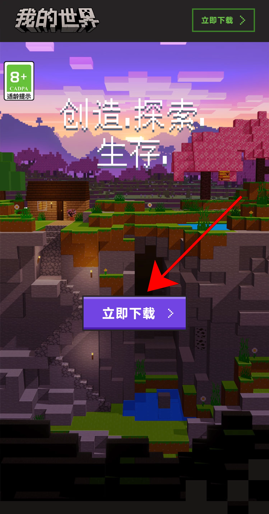
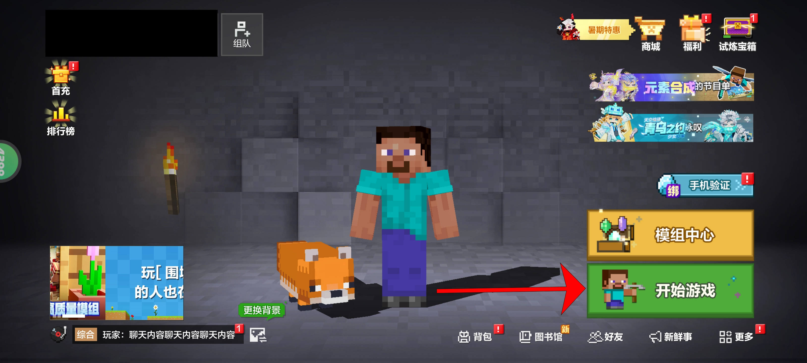
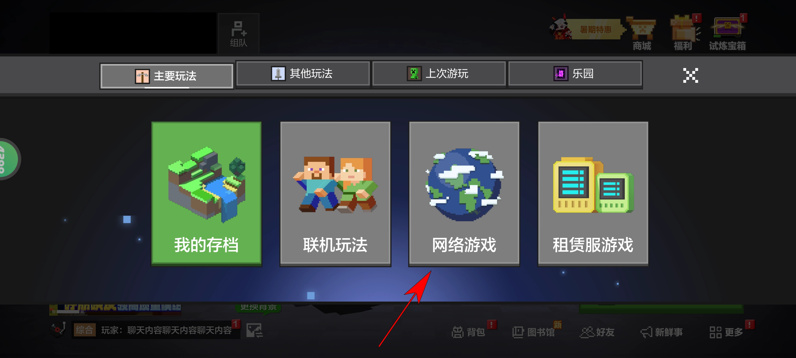
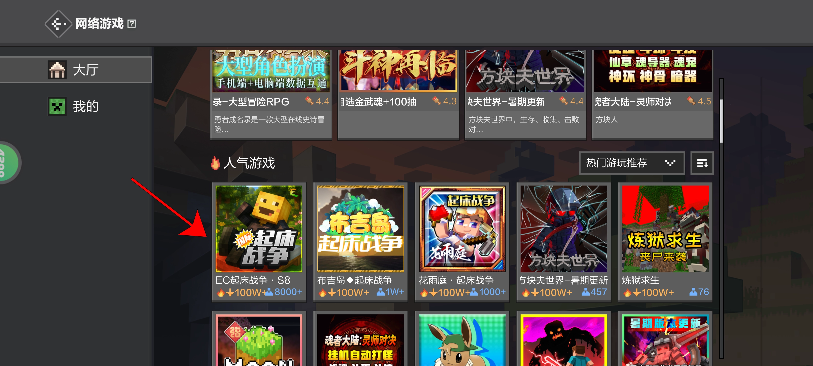
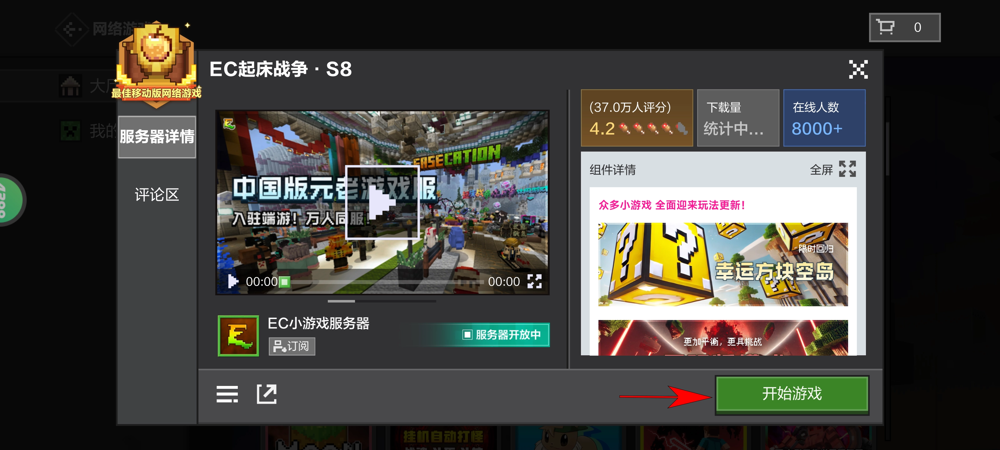
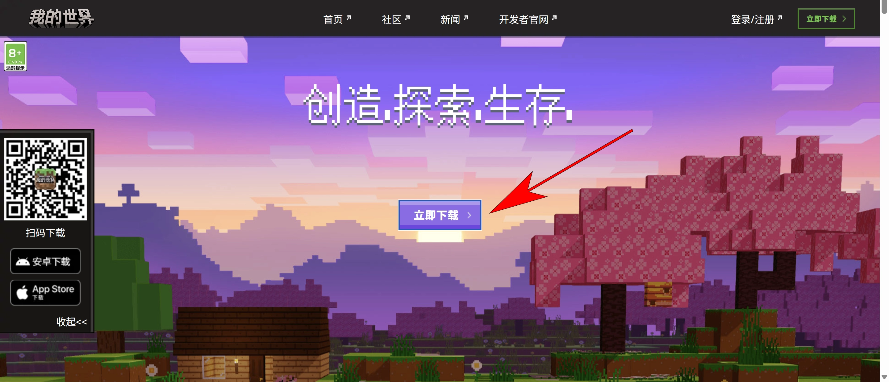
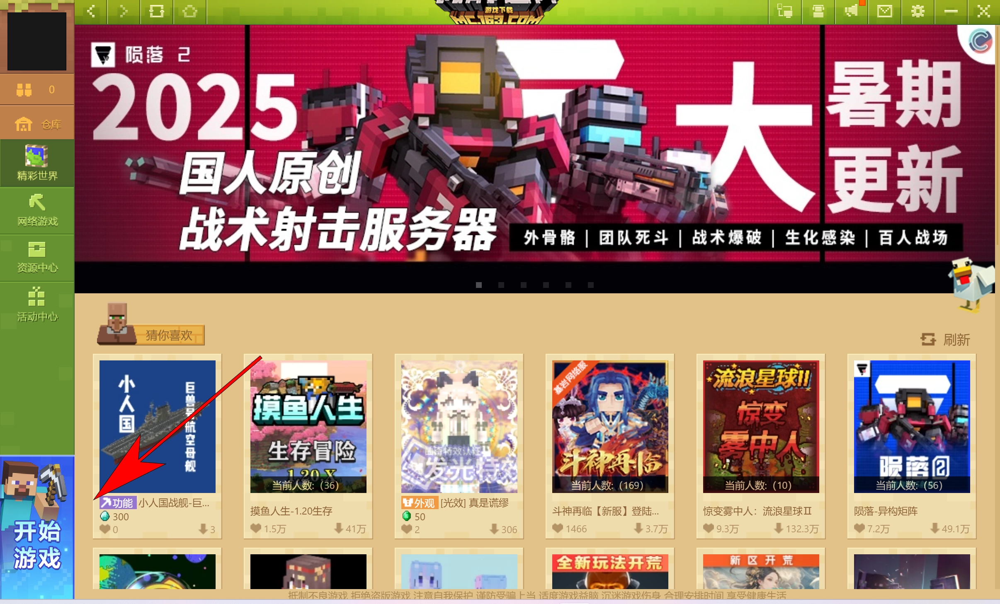
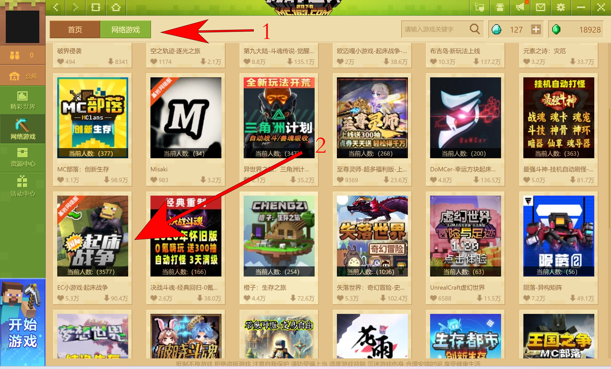
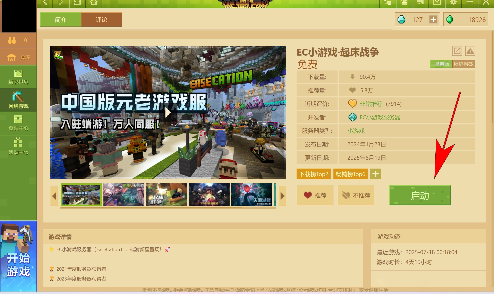

At the first,Thanks for your play ours game.Please select the guide by your platform.

## How to join EaseCation

### Mobile phone

**1.Install the"Minecraft China edition"**

Go to[Minecraft China edition official website](https://mc.163.com/m/)download and install the client

**2.Found "EaseCation" in the "Network game"page**

Please follow the image and operate

**3.Click the button of diagram location to download resources,and click the button again after resources downloaded**

Click the button of diagram location in the detail page to download the resources and join the server

(If you are first play our game,the button will show "Download resources",than will change to "Start game" after downloaded resources)

**4.Enjoy it ;)**

### Computer

**1.Install the"Minecraft China edition"**

Go to[Minecraft China edition official website](https://mc.163.com)download and install the client

**2.Found "EaseCation" in the "Network game"page**
Click the "Network game" menu in the launcher after login your account,found and click "EaseCation" in the network game list

**3.Download the resources and join the game**
Click the download button in the detail page to download resources and join game

(If you are first play our game,the button will show "Download resources",than will change to "Launch" after downloaded resources)

**4.Enjoy it ;)**