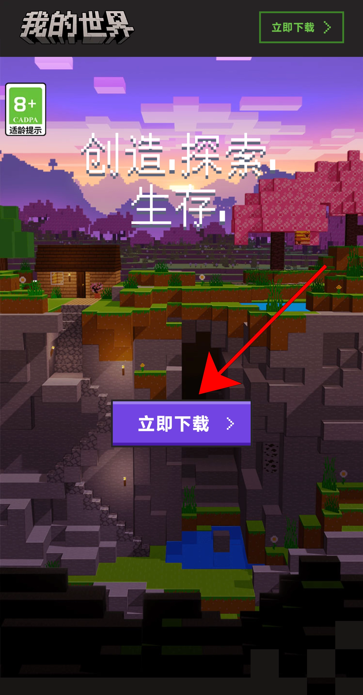
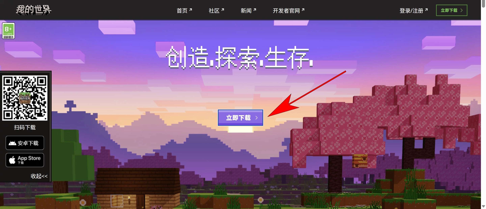
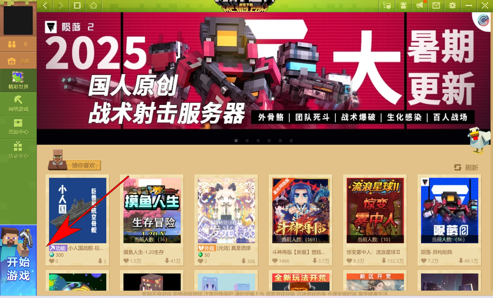

首先 感谢您选择了EaseCation小游戏服务器 请您根据自己的平台 在下面找到对应的教程并依据教程加入游戏

## 如何游玩EaseCation

### 移动端

**1.安装中国版"我的世界"**

请前往[网易我的世界中国版官网](https://mc.163.com/m/)下载并安装中国版客户端

**2.在"网络游戏"页面找到"EaseCation"**

根据下列图片指引操作即可

**3.点击图示位置按钮将下载所需的所有资源 完成后再次点击该按钮即可加入游戏**

在详情页内点击图示按钮即可下载所需资源并加入服务器

(如果首次游玩会显示为"下载资源" 下载完毕后会变成图内显示的"开始游戏")

**4.玩的开心 ;)**

### 桌面端

**1.安装中国版"我的世界"**

请前往[网易我的世界中国版官网](https://mc.163.com)下载并安装中国版客户端

**2.在"网络游戏"菜单中找到"EaseCation"**
在登录账号后 请安图片指示点击启动器的"网络游戏"菜单 并在其中找到"EaseCation小游戏服务器"并点击进入详情页

**3.下载所需资源后进入游戏**
在详情页内点击图示按钮即可下载所需资源并启动

(如果首次游玩会显示为"下载" 下载完毕后会变成图内显示的"启动")

**4.玩的开心 ;)**